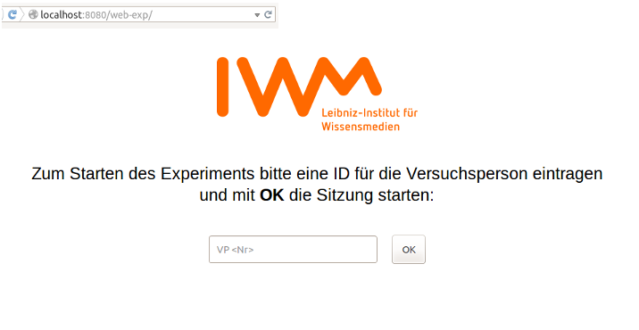
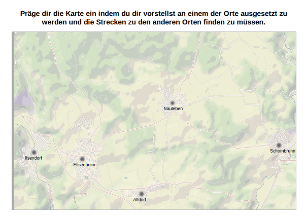
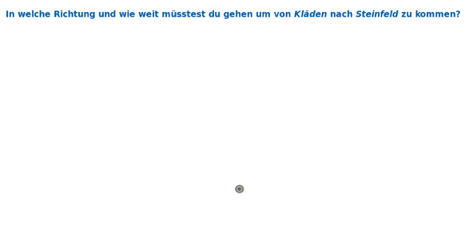
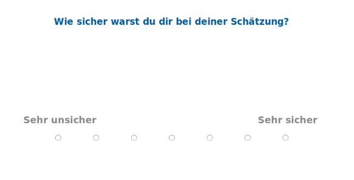
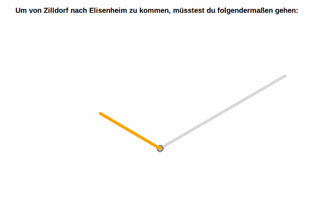
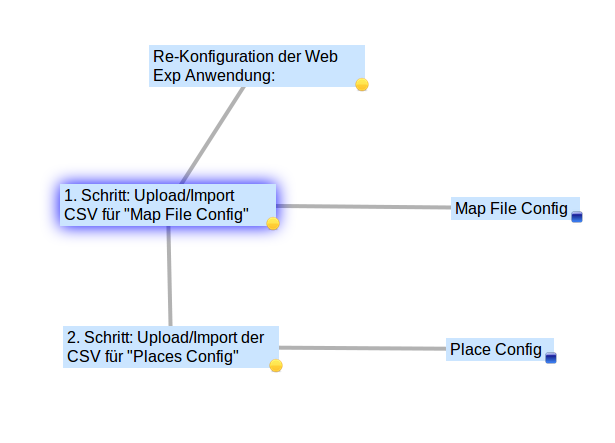
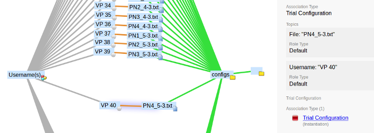

### Screenshots

Here you find some screenshots giving you an overall idea of the user interface and the scope of the application.

Screen to start the _session_ through entering a Participant ID.

 
#### Memorizing a map _without pinning_

Screen for a participant to memorize the map.

 
#### Mathematical filler task

 
#### Blank screen for participants to perform a distance and direction estimation

Blank screen to estimate direction and distance from one place to another.

 
#### Screen asking participants for their confidence in their latest estimation

 
#### Feedback for participants in a practice trial after an _estimation_

Feedback to  users estimation in practice mode.

 
#### Setting up the application via the Administration UI

Screen for loading the basic map and places configuration files.

 
#### Loading various trial configurations per participant

